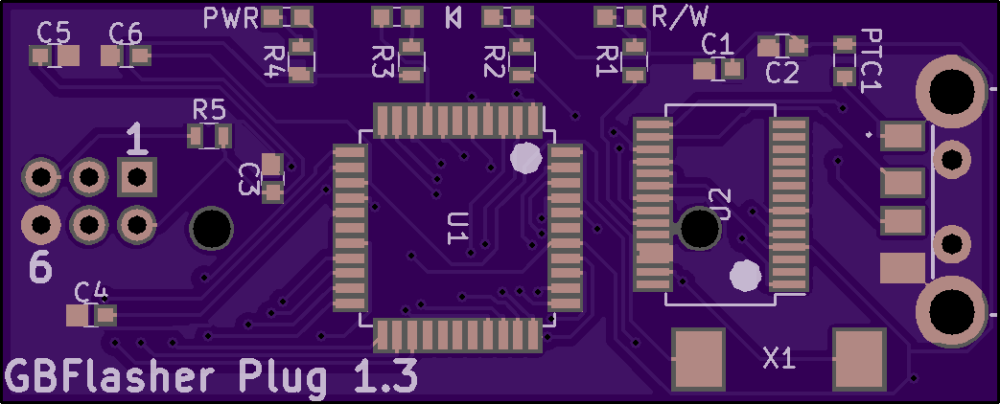

# No more cables
A clone of [J.Rodrigo's flasher](https://www.tindie.com/products/JRodrigo/cart-flasher-for-gameboy/)

[Purchase on OSHPARK](https://oshpark.com/shared_projects/C94Fgz71)


## Images




**Flashing the firmware**

Flashing is done over isp, i use a Raspberry pi for this, see https://github.com/MrHDR/RaspberryPi_ISP for more info

Raspberry Pi:
```
sudo avrdude -p atmega8515 -C ~/avrdude_gpio.conf -c pi_1 -U lfuse:w:0x1f:m -U hfuse:w:0xc9:m -B 6
sudo avrdude -p atmega8515 -C ~/avrdude_gpio.conf -c pi_1 -U flash:w:gbcf-2.1.hex -B 6
```

USBISP 
```
avrdude -c USBasp -p atmega8515 -U lfuse:w:0x1f:m -U hfuse:w:0xc9:m -B 6
avrdude -c USBasp -p atmega8515 -U flash:w:gbcf-2.1.hex -B 6
```

**BOM**

| Reference        | Part Number           | Description  |
| ------------- |:-------------:| -----:|
| C1 | 0603ZD104KAT2A | 0.1uF |
| C2 | 0603ZD104KAT2A | 0.1uF |
| C3 | NMC0603X5R106M10 | 10uF |
| C4 | 0603ZD104KAT2A | 0.1uF |
| C5 | C0603C220J5RACTU | 22pF |
| C6 | C0603C220J5RACTU | 22pF |
| U1 | Atmega8515L-8AU ||
| U2 | FT232RL ||
| J1 | 0480372100 | USB Type A Plug |
| J2 | Buy from Aliexpress | Cartridge Reader |
| LED1 | LSM0603412V | Red 0603 LED |
| LED2 | LSM0603463V | Blue 0603 LED |
| LED3 | LSM0603463V | Blue 0603 LED |
| LED4 | LSM0603453V | Green 0603 LED |
| PTC1 | MF-FSMF050X-2 | 500mA PTC Fuse |
| R1 | ERJ-PB3D1001V | 1K |
| R2 | ERJ-PB3D1001V | 1K |
| R3 | ERJ-PB3D1001V | 1K |
| R4 | ERJ-PB3D1001V | 1K |
| R5 | NTR06B1002DTRF | 10K |
| X1 | FQ1045A-6.000 | 6MHz Crystal |

**1.1 Changelog:**

- Changed IC Reference to U
- Changed reference XTAL1 to X1
- Reduced board height by 1,7mm
- Reduced board width by 4,3mm
- Replaced crystal with a lower profile one
- Added orientation indication for FT232RL
- Added indicator for led orientation
- Reduced board cost by 1,55 USD


**1.2 Changelog:**

- PCB changes


**1.3 Changelog:**

- Fixed wrong crystal footprint
- Reduced pcb cost by 0,8 USD